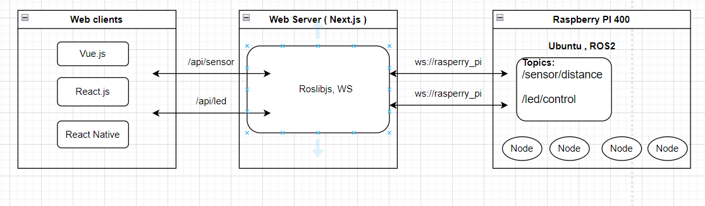

# app-control-iot-ros2

## A. Introduction

In the realm of robotics and Internet of Things (IoT), the integration between web and mobile applications with hardware platforms like the Robot Operating System (ROS) is becoming increasingly crucial. This demonstration is designed to showcase such an integration in a simplified yet practical manner, aiming to bridge the gap between software and hardware worlds.

This integration consists of three key elements:

1. Hardware: The hardware setup comprises a Raspberry Pi 4 or Raspberry Pi 400 operating on ROS2. This hardware is connected to a distance sensor <a href="https://www.adafruit.com/product/3317">VL53L0X</a> and a LED. ROS nodes will be established to create the /sensor/distance and /led/control topics. These topics are responsible for capturing the data from the distance sensor and controlling the LED's state, respectively.

2. API Endpoint Server: Next.js, a popular JavaScript framework, is employed to establish the API endpoint server. This server sets up HTTP API routes (/api/sensor and /api/led), directly linking these routes to the ROS topics (/sensor/distance and /led/control), thereby serving as a conduit for the hardware to interact with the web clients.

3. Web Clients: The client-side of the demonstration involves applications developed using Vue.js, React.js, and React Native. These clients are designed to connect to the API endpoint, retrieve real-time data from the distance sensor, plot this data in an interactive graph, and control the state of the LED (on/off).

Through these combined elements, I will demonstrate how diverse platforms such as Vue.js, React.js, React Native, Next.js, and ROS can communicate and interact in real-time, showcasing a fascinating blend of web, mobile, and robotic technologies.

The ultimate goal is to provide a clear understanding of this integration, enabling you to apply similar methodologies to your own unique projects.For more details on how to implement ROS in web clients, visit roslibjs at [https://github.com/RobotWebTools/roslibjs].

## B. Install and run

Please following the steps from the README for each of below folders in sequence.

1. ROS

   Setup and install ROS2 in raspberry Pi 4 or raspberry Pi 400

2. API server

   Setup and install API end point in Next.js

3. Vue.js client

   Setup and install Vue client

4. React.js client

   Setup and install Vue React.js client

5. React Native client

   Setup and install React Native client
