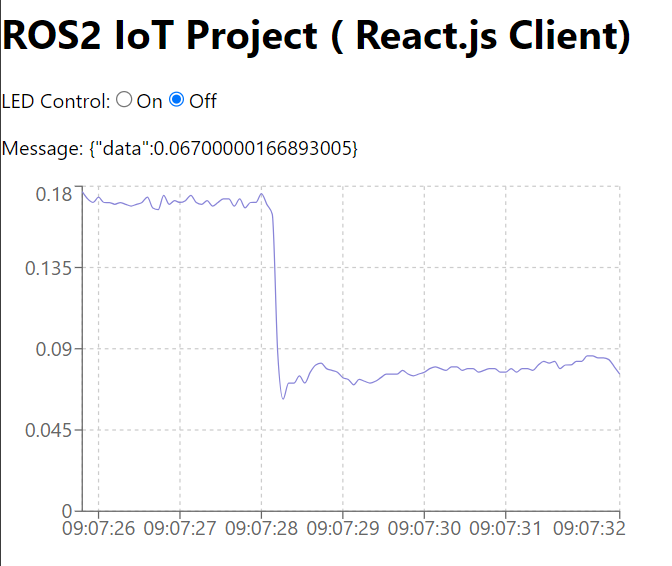

# Getting Started with Create React App



This project was bootstrapped with [Create React App](https://github.com/facebook/create-react-app).

### Edit environment variables

```
Edit .env, change HOST_URL to IP address of the ROS2 machine.

```

### Install and Run

```bash
   npm i
   npm run start
   # or
   yarn
   yarn run start
```
