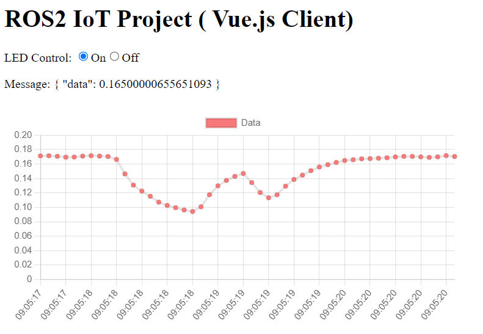

# app-vue



### Edit environment variables

```
Rename .env.sample to .env, edit .env, change VUE_APP_API_HOST_URL to IP address of the API Server.

```

## Project setup and run

```
npm install
npm run serve
```
